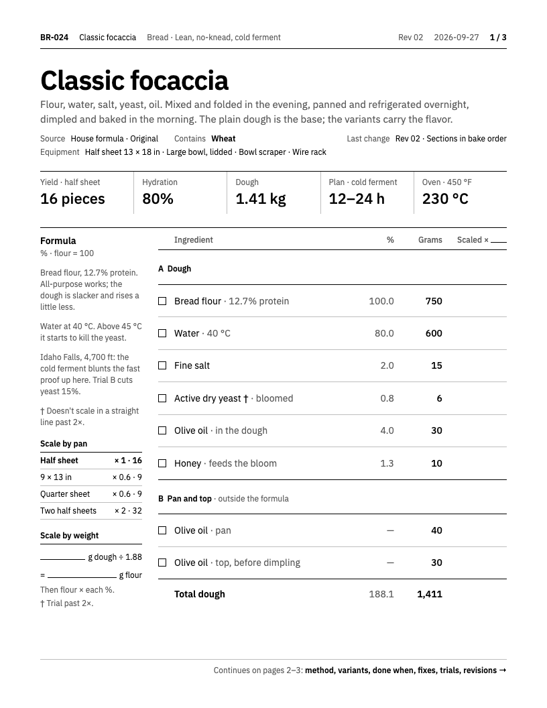
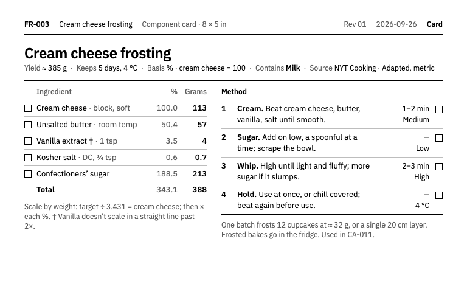
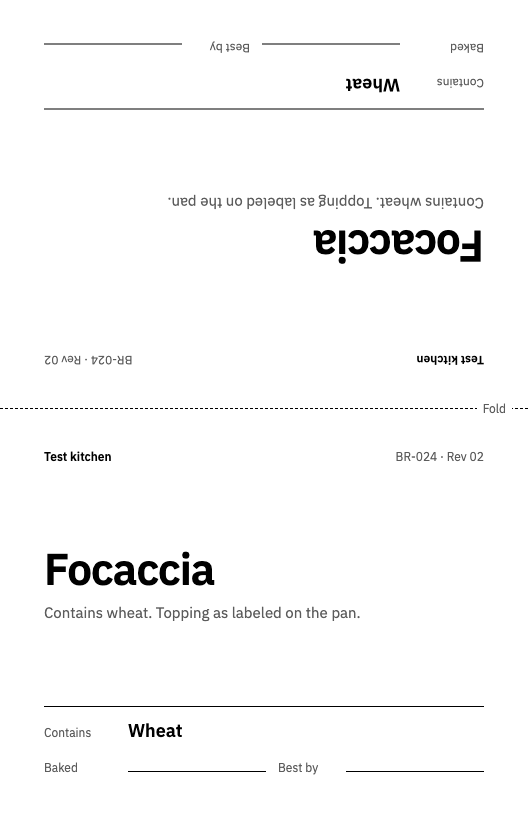

# Bench Sheet design system

This repository-owned reference describes the **existing** printed format. It was reconstructed from templates, figure code, fit checks and CONTRIBUTING on 2026-10-03. It is not a transcription of the earlier Claude artifact, which has not been reconciled here. Maintaining the current sheets does not require access to that artifact.

## Authority and purpose

Recipes own facts and authored page choices. [The contract](recipe-contract.md) defines their meaning; [CONTRIBUTING](../CONTRIBUTING.md) explains editorial judgment. Templates own exact presentation. If prose and templates disagree, preserve existing output, report the discrepancy and review an intentional correction.

The sheet supports weighing, following a method, checking a result and recording revisions. Grams must stand apart from percentages. Instructions and their parameters stay together. Decorative imagery must not displace useful instructions.

## Physical formats

The renderer uses 96 CSS pixels per inch; PDFs retain these sizes.

| Artifact | Canvas | Physical size | Current layout |
|---|---|---|---|
| Sheet / index | 816 × 1056 px | US Letter, 8.5 × 11 in | Sheet padding 48 px vertically, 60 px horizontally; 696 px inner width. |
| Component card | 768 × 480 px | 8 × 5 in | Padding 32 px vertically, 40 px horizontally; formula column 300 px, gap 24 px. |
| Tent | 528 × 816 px | 5.5 × 8.5 in unfolded | Two 408 px faces; upper face rotated 180°; dashed central fold. |

Fit checks limit content to y=968 on Letter and y=448 on cards. Tents use the full board. The Letter limit protects footer space. A passing fit measurement still requires visual review, especially SVG text and page transitions.

## Type, marks and page anatomy

- IBM Plex Sans 400/500/600 is vendored in [fonts](../fonts/), with its existing license.
- Black `#000000` primary text; grey `#5C5C5C` secondary information; `#BDBDBD` light rules; white background.
- Intended minimum type size 12 px. Sheet method/formula generally uses 14 px; cards generally 13 px. Authors do not override these per recipe.
- Numeric grams use black/500; percentages grey/400; totals and heads use stronger emphasis. Numeric columns use tabular figures.
- Squares are checkboxes; arrows express movement or explicit carry; a dash means unspecified, never zero; daggers point to scaling notes.
- No decorative shadows, color panels, rounded UI cards or food photographs. Technical diagrams may use solid regions, hatch and stipple for meaning.

Sheet sections have a 152 px rail, 24 px gap and 520 px content column. Identity/revision, title/source and five key figures introduce the sheet. Formula precedes method; components/schedule prepare the work. Method chunks retain order; figures sit beside their steps. Variants follow the final method step. Done-when checks, fixes and revisions follow making. Trials and blank batch logs may float within CONTRIBUTING's rules.

An explicit `pages` list is a reading plan, not merely display metadata. Cover every method step exactly once. Do not move checks ahead of the method to fill a page.

Sources: [macros](../templates/macros.html.j2), [sheet](../templates/sheet_page.html.j2), [card](../templates/card.html.j2), [tent](../templates/tent.html.j2), [index](../templates/index.html.j2), [fit checker](../tools/fit.py).

## Figures and changes

Representative snapshots generated on 2026-10-03 from FR-003 Rev 01 and BR-024 Rev 02,
whose artboard markup matches baseline `c98372b`. They illustrate the format, not
new recipe testing; rerender current sources for actual use. Displayed image size is
not physical print size.

| Sheet | Component card | Tent |
|---|---|---|
|  |  |  |

The [diagram handbook](figures.md) covers generated diagrams and authored SVG schedules/shaping drawings. Solid edges, dashed folds/cuts, arrows, ticked dimensions, hatch and stipple have specific meanings. Never imply measured precision the recipe does not establish.

For overflow, shorten prose, then move/split sections. Use only existing documented density controls. Never shrink type or add per-recipe CSS; never scale a physical gauge down to fit.

For renderer changes run `python -m pytest -q` and `python build.py check`, then inspect sheet/card/tent PDFs. [Frozen examples](../tests/fixtures/README.md) protect exact markup. Baseline updates need an explained visual change, not merely a failing test. Generate current screenshots with `preview CODE`; old images do not prove a new edit fits.
